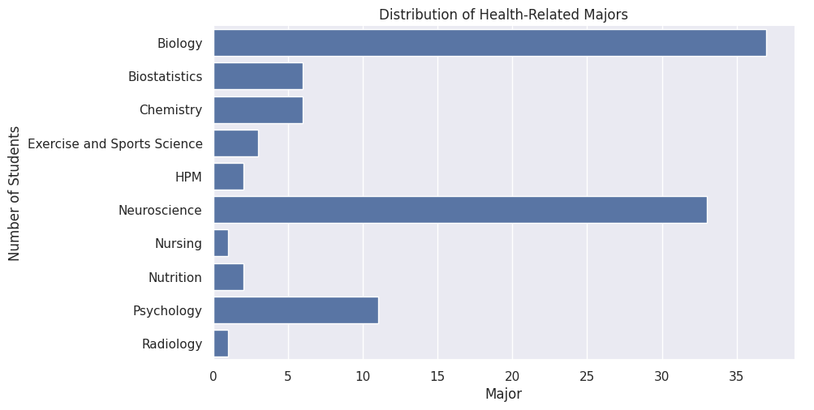
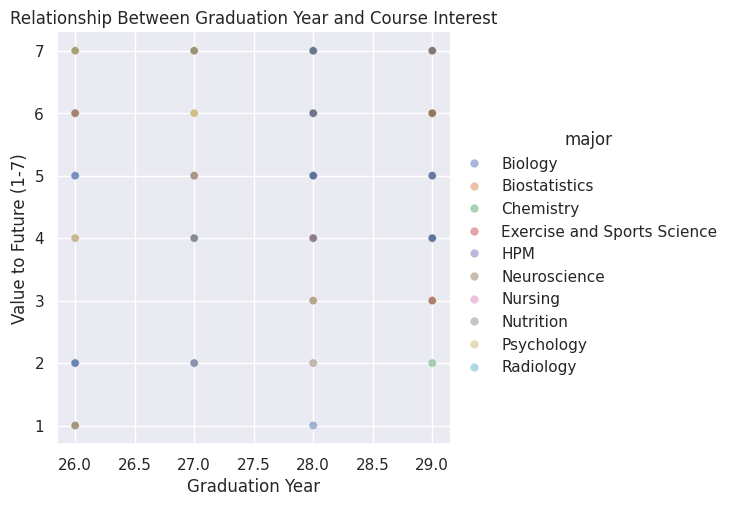
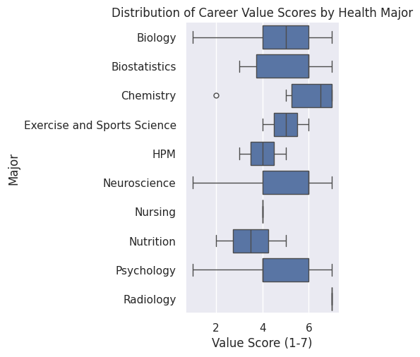

---
# Do not edit the text between these lines!
layout: home
---

# Project: Improving COMP 110 with Biological Data Exercise

<!-- This is a comment. Below, you'll see code for inserting an image. To make this image appear, update <custom-path>. To add an image, save it inside the imgs folder of this repository. -->

## The Idea
My proposal is to integrate a biological data exercise into the COMP 110 curriculum to better serve the the large amount of health related majors in the course.

## Stakeholder Analysis
After analyxing the course data, I identified 102 students currently majoring in health-related fields in the course. This represents a massive portion of the student body that would benefit from health-specific data context.

### Distribution of Majors

*This count plot demonstrates the significant volume of health-related majors in this section.

### Career Value vs. Graduation Year

*This scatterplot explores whether health-related majors closer to graduation see greater value of the course to their future careers.*

### Career Value by Specific Health Major

*This box plot reveals the variation in perceived value across and within different health-related disciplines.*

## 4. Conclusion

**Summary:** The analysis strongly supports the proposal. With 102 stakeholders showing high career-value scores (median 5-7), there is a clear demand for more relevant data contexts.

**Trade-offs:** The primary costs are instructor development time and the risk of over-specialization, which might alienate students in Business or Computer Science.

**Future Work:** I recommend a "modular" approach where students can choose between biological, financial, or social-science datasets for their exercises to maximize relevance for everyone.